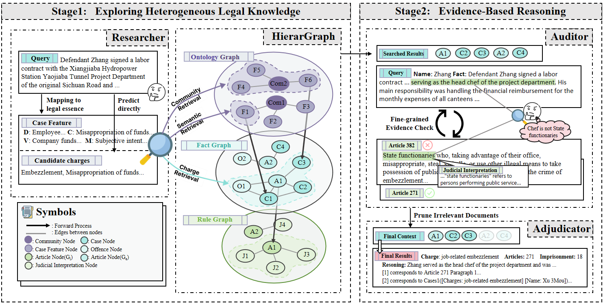

# **LegalGraphRAG: Multi-Agent Graph Retrieval-Augmented Generation for Reliable Legal Reasoning**

> An evaluation framework for legal judgment prediction that integrates multi-agent graph retrieval and supports reproducible comparisons across multiple models and baselines.

<!-- <p align="center">
  <a href="https://www.researchgate.net/publication/403734810_LegalGraphRAG_Multi-Agent_Graph_Retrieval-Augmented_Generation_for_Reliable_Legal_Reasoning" target="_blank">
    
  </a>
  <a href="https://github.com/DEEP-PolyU/LegalGraphRAG" target="_blank">
    
  </a>
</p> -->

---

## 🚀 **Highlights**
- ✅ **Automated Evaluation**: Computes `Accuracy (Acc)` and `Micro-F1` automatically for legal judgment prediction tasks.
- ✅ **Multi-Model Support**: Supports Qwen, DeepSeek, GPT, InternLM, GLM, Gemma, and more.
- ✅ **Dataset Coverage**: Includes legal datasets such as CAIL and CMDL.
- ✅ **Baseline Comparison**: Enables direct comparison with `HippoRAG2`, `RAPTOR`, `LightRAG`, `LegalΔ`, and `ADAPT`.

<p align="center">
  
</p>

---

## 🧩 **Project Structure**

```text
LegalGraphRAG/
├── core/                      # Core modules
│   ├── LegalGraphRAG.py       # Main LegalGraphRAG class
│   ├── models/                # Model implementations
│   │   ├── transformers/      # Transformers-based models (Qwen, InternLM, GLM, Gemma)
│   │   └── openai/            # OpenAI-compatible models (DeepSeek, GPT)
│   ├── graph_construct/       # Graph construction and management
│   ├── judge/                 # Legal judgment modules
│   ├── preprocess/            # Data preprocessing
│   ├── prompt/                # Prompt templates
│   └── utils/                 # Utility functions
├── scripts/                   # Data preparation scripts
├── raw_data/                  # User-provided source files for preprocessing
├── datas/                     # Generated preprocessing outputs
├── run.py                     # Main evaluation script
├── env.example                # Configuration file template
└── README.md                  # Project documentation
```

---

## 🛠️ **Usage**

### 1️⃣ Environment Setup

```bash
# Install dependencies
pip install -r requirements.txt

# Copy and configure environment file
cp env.example .env
# Edit .env with model paths, API keys, and runtime settings
```

### 2️⃣ Data Preparation (CAIL Example)

Put these source files under `./raw_data/`:

- `final_test.json`: raw CAIL case records used to build the case corpus.
- `law_to_crime.json`: base mapping from law article ids to candidate crimes.
- `criminal_law_processed.json`: structured criminal law articles (article id + item texts).
- `judicial_explanations.json`: judicial interpretation snippets linked to law article ids.
- `law_corpus.jsonl`: full law text corpus used as fallback when law text is missing.

Use one command to prepare all required data:

```bash
python scripts/prepare_data.py --dotenv-path .env --raw-data-dir ./raw_data
```

This pipeline does four things in order:

- Builds sampled CAIL cases from raw records.
- Uses an LLM to extract structured case features.
- Uses an LLM to generate law judgment dependency hints.
- Merges law resources into final project-ready law mapping data.

After these steps, make sure both files exist:

- `datas/cases_with_feature.json`
- `datas/law_to_crime.json`

### 3️⃣ Run Evaluation

```bash
python run.py --model qwen3 --datasets CAIL --devices cuda:2 cuda:3
```

**Main arguments**

- `--model`: `qwen3`, `qwen2_5`, `gemma3`, `internlm3`, `glm4`, `deepseek_v3`, `gpt4o_mini`
- `--datasets`: dataset name, e.g. `CAIL`, `CMDL`
- `--dotenv_path`: path to `.env` (default: `.env`)
- `--datasets_path`: path to datasets (default: `../datasets`)
- `--devices`: GPU devices, e.g. `cuda:0 cuda:1`
- `--no-build-graph`: skip graph construction when graph already exists
- `--force-rebuild`: force graph rebuild even if artifacts already exist

### 4️⃣ Output Files

- Prediction outputs:
  - `{output_dir}/{dataset}/{model}_results_combined.json`
- Statistics:
  - `{output_dir}/{dataset}/{model}_stats.json`

Example output summary:

```json
{
  "model_name": "qwen3",
  "dataset": "CAIL",
  "total_cases": 1000,
  "correct_count": 850,
  "elapsed_time": 3600.0,
  "output_file": "./outputs/CAIL/qwen3_results_combined.json"
}
```

---

## ⚙️ **Configuration**

Configuration is managed via `.env`. Key groups include:

- **Model Configuration**: model names, devices, API keys, generation parameters
- **Data Configuration**: dataset paths and output directory
- **Graph Configuration**: graph construction and retrieval settings

See `env.example` for the full configuration list.

---

## 🎯 **Supported Models**

- Qwen3-8B
- Qwen2.5-7B-Instruct
- DeepSeek-V3
- GPT-4o-mini
- InternLM3
- GLM-4

---

## ⚡ **Multi-GPU Execution**

Run on multiple GPUs by passing several devices:

```bash
python run.py --model qwen3 --datasets CAIL --devices cuda:0 cuda:1 cuda:2 cuda:3
```

Cases are automatically distributed across the selected devices.
